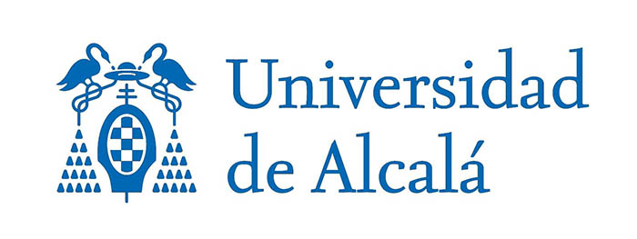
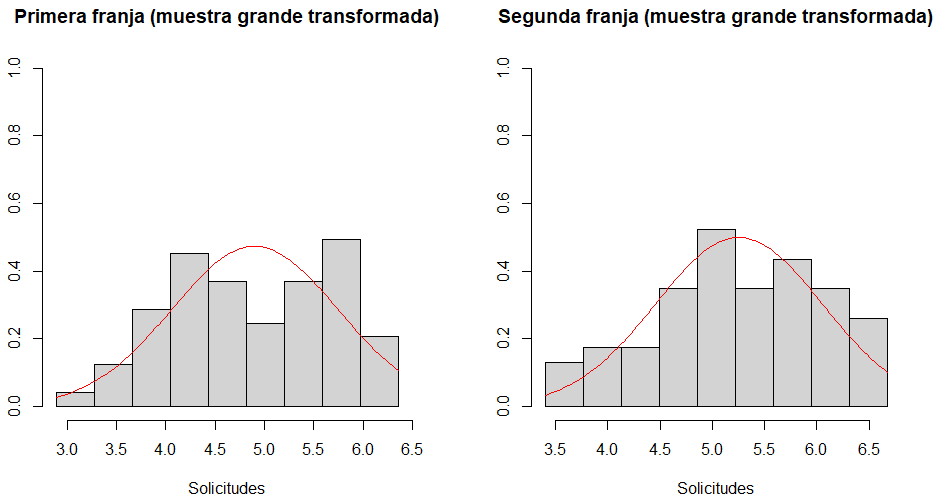
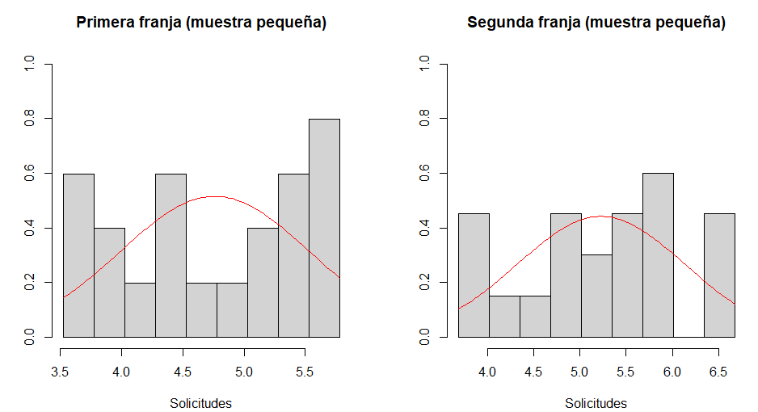

# Análisis de las solicitudes de uniones de hecho por la población de castilla y león
---

### Autor:
**Gonzalo Rodríguez Castro**

### Grado:
**Ingeniería en Sistemas de la Información**

### Fecha:
**10/12/2024**

 
 
 
 
 
 
 
 
 
 

 
 
 
 
 
 
 

## Índice
1. [Introducción](#introducción)
-   1.1 [Contexto](contexto)
-   1.2 [Objetivo](objetivo)
-   1.3 [alcance](alcance)
2. [Metodología](metodologia)
-   2.1 [Origen de los datos](origen)
-   2.2 [Herramientas](herramientas)
-   2.3 [Diseño](diseño)
3. [Resultados](resultados)
-   3.1 [Medidas estadístcas](medidas)
-   3.2 [Tablas de contingencia](tablas)
-   3.3 [Diagramas](diagramas)
4. [Análisis de resultados](analisis)
5. [Conclusión](conclusion)

## <u> Introducción </u>

### <strong>Contexto</strong>
En la comunidad de Castilla y León se solicitan anualmente miles de solicitudes de uniones de hecho, debido a la gran cantidad de solicitudes en el ultimo año, se han dividido el numero de solicitudes en dos grandes grupos, el primero se engloba con todas las solicitudes desde el año 2010 hasta el año 2016 y el segundo grupo contiene todas las solicitudes que comprenden desde el año 2017 hasta el año 2023

### <strong>Objetivo</strong>
El objetivo de la investigación es: "Realizar un análisis estadístico descriptivo de las solicitudes de hecho en la comunidad de Castilla y León comparando las diferencias que existen respecto a número de solicitudes de los ultimos años con las solicitudes de años pasados".

### <strong>Alcance</strong>
La investigacion se limita al número de solicitudes de uniones de hecho localizadas en Castilla y León en los años que comprenden entre 2010 y 2023.

## <u>Metodología</u>
### <strong>Poblaciones y propiedad estudiada</strong> 
Las poblaciones sobre las que se realizará la inferencia son dos y se desconoce su tamaño:
- Uniones de hecho entre los años 2010 y 2016
- Uniones de hecho entre los años 2017 y 2023
La propiedad de las uniones que se han utilizado en el estudio son:
- Tipo de union (ya sea una union homosexual o heterosexual)
### <strong>Muestras y origen de los datos</strong>
Se han seleccionado dos muestras de cada poblacion para realizar el estudio:
- Muestras grandes: Se ha seleccionado una muestra de 63 meses de la primera franja y una muestra de 63 meses de la segunda franja obteniendo todas las solicitudes realizadas en cada uno de los meses, en el que podemos diferenciar dos tipos de uniones de hecho, las uniones homosexuales y las uniones heterosexuales
- Muestras pequeñas: Para comparar resultados utilizando tambien muestras pequeñas, se han seleccionado aleatoriamente una muestra de 20 meses de la primera franja y 20 meses de la segunda franja

Se ha trabajado con un archivo "uniones_de_hecho.csv" que incluye todas las solicitudes presentadas en Castilla y León en los ultimos años. El archivo ha sido presentado por el ayuntamiento de la comunidad de Castilla y León.

### <strong>Normalidad de los datos</strong>
Se realizaron evaluaciones de normalidad para las muestras grandes y pequeñas mediante pruebas gráficas y estadísticas. Los resultados no proporcionan evidencia suficiente para asumir normalidad en ninguno de los casos.

- <u>Muestras Grandes</u>
    - <u>Gráficos QQ (Quantile-Quantile):</u>
        Para ambas franjas temporales (primera y segunda), los diagramas QQ muestran desviaciones significativas respecto a la diagonal de normalidad. Esto indica que los datos no siguen una distribución normal de manera evidente.
    - <u>Prueba de Jarque-Bera:</u>
        Los resultados de la prueba rechazaron la hipótesis nula de normalidad en ambas franjas (primera y segunda) a un nivel de significación convencional (𝑝<0.05).
- <u>Muestras Pequeñas</u>
    - <u>Gráficos QQ:</u>
        En los diagramas QQ de las muestras pequeñas (20 valores seleccionados aleatoriamente por franja), se observa un patrón no alineado con la diagonal, reforzando la falta de normalidad.
    - <u>Prueba de Shapiro-Wilk:</u>
        La prueba de Shapiro-Wilk confirmó que las muestras pequeñas tampoco cumplen con los criterios de normalidad, rechazando la hipótesis nula de distribución normal (p<0.05).
- <u>Aproximación de los datos:</u>
    Como los datos no tenían una distribución normal para aproximarlo a una distribución normal hubo que hacer el logaritmo de todos los datos seleccionados para poder aproximarlo, tras la transformacion de los datos todos los tests de normalidad pasaron correctamente
### <strong>Hipótesis</strong>
La investigación pretende comprobar si se cumplen las siguientes hipotesis:
1. Hipótesis: Existe una diferencia significativa entre la media de las solicitudes de la primera franja y la media de la segunda franja.

2. Hipótesis: Existe una diferencia significativa entre la mediana de las solicitudes de la primera franja y la mediana de las solicitudes de la segunda franja.

3. Hipótesis: Existe una diferencia significativa entre la proporción de solicitudes de parejas homosexuales en la primera franja y la proporción de solicitudes de parejas homosexuales en la segunda franja.

4. Hipótesis: Existe una diferencia significativa entre la proporción de solicitudes de parejas heterosexuales en la primera franja y la proporción de solicitudes de parejas heterosexuales en la segunda franja.

### <strong>Herramientas</strong>
Se han procesado los datos utilizando la aplicación RStudio para linux, versión 2024.09.0+375 y el paquete "e1071" para calcular los coeficientes de asimetría y apuntamiento. El trabajo de informe estadístico ha sido realizado en el lenguaje de marcado ligero: Markdown, utilizando como entorno de desarrollo Visual Studio Code en su versión 1.94.2. Como control de versiones se ha utilizado GitHub.

## <u>Resultados</u>
### <strong>Normalidad de los datos</strong>
Se ha realizado una comprobación visual para cada una de las muestras, obteniendo los histogramas de las figuras 1 y 2 que se aproximan a la distribución normal.

Figura 1

 

Figura 2

 
Tambien se han obtenido los diagramas QQ con región de aceptación del 95% que se representan en las figuras 3 y 4
 

Figura 3

 

 

Figura 4

 

En la tabla 1 se muestran los resultados de los test de normalidad realizados despues de las transformaciones de los datos para cada una de las muestras

| Test de Normalidad | Primera franja Muestra Grande| Segunda franja Muestra Grande | Primera franja Muestra Pequeña | Segunda franja Muestra Pequeña |
|------------------|----------------|----------------|-------|-------------|
| <strong>Shapiro-Wilk</strong> | p-valor= 0.08548| p-valor= 0.3255| p-valor= 0.2182| p-valor= 0.337|

Tanto en el caso de las muestras pequeñas como el de las muestras grandes, se ha superado el test de Shapiro-wilk, para un nivel de significación de 0,05 pues los p-valores superan dicho valor. 

### <strong>Análisis de homogeneidad de varianzas</strong>
Para evaluar si las varianzas de las poblaciones son iguales o diferentes, se llevó a cabo un test de Levene de homogeneidad de varianzas. En el caso de las muestras grandes, se obtuvo un p-valor = 0.3616, mientras que para las muestras pequeñas el p-valor fue = 0.5515. Dado que ambos valores son mayores al nivel de significación habitual de 0.05, se puede asumir que las varianzas de las franjas Primera y Segunda son iguales en ambos casos.
### <strong> Intervalos de confianza</strong>
En la tabla 2 se muestran los resultados del cálculo de los intervalos de confianza utilizando las
muestras grandes, con una confianza del 95%, es decir, con una significación de 0.05. Se han
calculado intervalos para la media poblacional de las solicitudes de las parejas de cada franja, y para las
proporciones de diferentes tipos de parejas:

- Parejas Homosexuales
- Parejas Heterosexuales

| Medidas | Primera Franja | Segunda Franja |
|---------|-----------------|----------------|
| Tamaño muestra | 63 | 63 |
| Media (muestra) | 185.1746 | 254.127 |
| Mediana (muestra) | 141 | 186 |
| IC (95%) media | | |
| Prop. Parejas Homosexuales (muestra) | | |
| IC (95%) Prop. Parejas Homosexuales | | |
| Prop. Parejas Homosexuales (muestra) | | |
| IC (95%) Prop. Parejas Homosexuales | | |